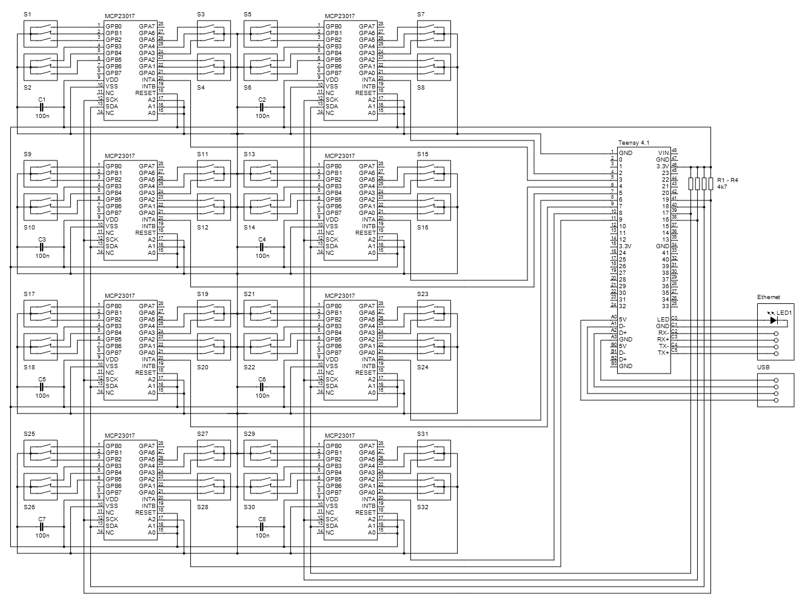

# hexaTurn
Teensy 4.1 based input unit with 32 rotary encoders
#### Features
#### GPIO I2C A MCP23017
* GPIO 18 - SDA
* GPIO 19 - SCL
#### GPIO I2C B MCP23017
* GPIO 17 - SDA
* GPIO 16 - SCL
#### GPIO MCP23017 Interrupts
* GPIO 2 - Int A
* GPIO 3 - Int B
* GPIO 4 - Int C
* GPIO 5 - Int D
* GPIO 6 - Int E
* GPIO 7 - Int F
* GPIO 8 - Int G
* GPIO 9 - Int H
#### Development Hardware
#### Schematic
